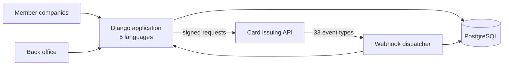

# NegotiNation — Architecture

Case study of a B2B platform where small businesses pool their purchasing
power to get negotiated supplier rates, with branded payment cards and tiered
subscriptions. Freelance work for a client, sole developer. **The platform was
sold in 2026** and handed over to the buyer with no service interruption.

**Live:** [www.negotination.com](https://www.negotination.com)
**Role:** sole developer, designer and operator — January to August 2025, 55 commits
**Size:** ~5,300 lines of Python, 5 languages

> **No source code here.** The platform now belongs to its buyer. This
> document describes how it was built.

## The problem

Small businesses pay list price because they buy alone. The platform groups
them, negotiates on their behalf, and issues each member company a payment
card tied to the programme — which means the product is not a catalogue but a
card issuing integration wearing a marketplace's clothes.

## Constraints that shaped the design

- **The card issuer authenticates by signature, not by token.** Getting it
  wrong fails silently in the worst cases.
- **Card events arrive whenever they arrive.** An authorization decision, a
  3-D Secure challenge or a KYC status change does not wait for the
  application to be ready.
- **Companies, not people.** The account model is a company with members,
  addresses and a billing relationship.

## Service map

## Card issuing integration

**Request signing.** Calls are authenticated by an asymmetric signature rather
than a bearer token, with payload integrity covered by the signature itself.
Covered by integration tests, because a signing bug is invisible until it is
expensive.

**Webhook dispatcher — 33 event types**, each logged to the database before it
is acted on:

| Family | Events |
|---|---|
| Card lifecycle | order, personalization, activation, blocking, renewal |
| Payments | authorizations, authorization decisions, clearing, fees |
| Strong authentication | 3-D Secure OTP, Apple Pay |
| Compliance | KYC status changes |

Logging the raw event first means a handler bug can be fixed and the event
replayed, rather than lost.

## Technical decisions

| Decision | Why | Trade-off |
|---|---|---|
| Log every webhook event before handling it | An event is the only record of something that happened outside the system; losing one is unrecoverable | An append-only table that needs a retention policy |
| One dispatcher, 33 handlers, one contract | Adding an event type is a handler, not a new endpoint | A fat module that has to stay disciplined |
| Custom user model and company profiles from the start | Retrofitting a company-centric account model onto Django's user is painful | Extra work before the first feature ships |
| A commercial Bootstrap theme integrated into Django templates | A solo developer does not out-design a design studio on a B2B budget | Theme updates have to be reintegrated by hand |
| 5 languages from the first release | The target market is European, not French | Every copy change is five changes |

## Security and abuse

- django-allauth with social login, django-easy-audit for the trail.
- Bot protection on public forms and a hardened admin path.
- Keys and secrets injected as environment variables, never in the repository.

## Operations

- Docker, PostgreSQL.
- Hosted on **AWS, then migrated to Railway** to cut running costs.
- **Sold and handed over to the buyer with no service interruption.**

## Stack

`Python` `Django` `Django REST Framework` `PostgreSQL`
`Docker` `AWS` `Railway` `django-allauth` `django-easy-audit` `Bootstrap 5`

## Scope note

The public site advertises a cashback scheme and a wider B2B programme. Those
were never built. What is described above is what exists in the code.

## Related

- [StarShipDealers — Architecture](https://github.com/Meranhor/starshipdealers-architecture)
- [GoldenHive — Architecture](https://github.com/Meranhor/goldenhive-architecture)
